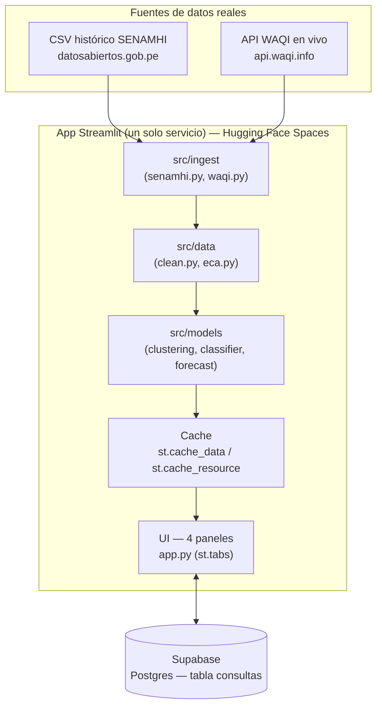

# Documento de Diseño e Implementación

**Proyecto:** Predicción y monitoreo de la calidad del aire en Lima Metropolitana
**Curso:** Minería de Datos 2026-I — UNMSM-FISI
**Estado:** v2 — implementado y publicado en https://github.com/AxcelCH/calidad-aire-lima (hosting pendiente, ver sección 11)
**Última actualización:** 14 de julio de 2026

> **Cómo usar este documento:** es la referencia técnica única del proyecto. Cualquier decisión de arquitectura, regla de negocio o funcionalidad debe reflejarse aquí antes de darse por definitiva. Cada cambio relevante debe agregarse a la tabla de la sección 15 (Historial de cambios). Este archivo, junto con `CONTEXT_LOG.md`, está pensado para poder pegarse al inicio de una conversación con cualquier modelo de IA (Claude, Fable u otro) y que retome el proyecto sin perder contexto.

---

## 1. Resumen y alcance

Dashboard analítico de 4 paneles (EDA + clustering, predictivo, pronóstico, CRUD) sobre calidad del aire en Lima Metropolitana, construido con datos reales de SENAMHI (histórico) y la API WAQI/aqicn.org (en vivo). Cumple los requisitos del trabajo final del curso (ver `Propuesta_Proyecto_MineriaDeDatos_v2.docx` en la carpeta `Propuesta/`) y añade una capa de implementación web real: hosting público, backend de entrenamiento/inferencia y base de datos persistente.

**Fuera de alcance (para no sobrecomplicar):** autenticación de usuarios, multi-tenant, paneles de administración separados, NLP (opcional del curso, no incluido salvo que el equipo decida agregarlo más adelante).

## 2. Principios de diseño

1. **Simplicidad ante todo (KISS).** El equipo tiene nivel básico-intermedio en Python; cada pieza de la arquitectura debe poder explicarse en una frase y modificarse en vivo frente al profesor.
2. **Un solo servicio, no un sistema distribuido.** Streamlit actúa como frontend *y* backend a la vez (recibe la petición del navegador, entrena/infiere, responde). Evitamos el par frontend-separado + API propia porque duplica despliegues, credenciales y puntos de falla — justo lo que el profesor penaliza si algo no funciona en vivo.
3. **Todo dato real y verificado**, nunca de Kaggle/UCI (ver sección 6).
4. **Cache agresivo, cómputo perezoso.** Nada se recalcula si no cambió (uso de `st.cache_data` / `st.cache_resource`).
5. **Degradación controlada.** Si una fuente externa (API WAQI, Supabase) falla durante la demo, la app sigue funcionando con lo que tiene en caché o local, nunca se cae.
6. **El historial de decisiones es parte del entregable**, no un extra (secciones 14-15 y `CONTEXT_LOG.md`).

## 3. Stack tecnológico

| Capa | Elección | Justificación |
|---|---|---|
| Lenguaje | Python 3.11 | Todo el curso y las librerías de ML (sklearn, xgboost, shap, statsmodels) son Python. Evita traducir lógica a JS. |
| Framework de app / dashboard | Streamlit | Recomendado por el propio sílabo, curva de aprendizaje mínima, un solo archivo puede levantar los 4 paneles con `st.tabs()`. |
| Hosting del dashboard | **Pendiente** — HF Spaces descartado el 14/07/2026: el free tier actual solo ofrece ZeroGPU (exclusivo de Gradio) y CPU Basic pasó a requerir suscripción PRO. Candidato principal: **Streamlit Community Cloud** (gratis, deploy directo del repo GitHub) | La app es un solo servicio Streamlit sin dependencias de la plataforma: cualquier host que corra `streamlit run app.py` sirve. Ver sección 11. |
| Modelos de clasificación | scikit-learn `RandomForestClassifier` vs XGBoost | Pedido explícito de la rúbrica (comparación obligatoria de ≥2 modelos). |
| Interpretabilidad | `shap` (TreeExplainer) | Obligatorio en Panel 2. |
| Clustering | scikit-learn `KMeans` (+ `DBSCAN` opcional) | Obligatorio en Panel 1. |
| Series de tiempo | `statsmodels` (suavizado exponencial / ARIMA) o `prophet` | Panel 3, con MAPE/RMSE. |
| Desbalance de clases | `imbalanced-learn` (SMOTE) | Requisito de la rúbrica si hay >80/20. |
| Base de datos (CRUD, Panel 4) | **Supabase (Postgres)** | Postgres real con API REST y Python client (`supabase-py`) listos, panel de administración visual para depurar en vivo, free tier suficiente (500 MB, ~2-5M filas). |
| Ingesta histórica | Descarga directa del CSV oficial SENAMHI | Ver sección 6. |
| Ingesta en vivo | API WAQI (`api.waqi.info`) | Ver sección 6; ya verificada con token real (13/07/2026). |
| Control de versiones | Git + GitHub (repo único) | Estándar, y GitHub Actions se puede usar más adelante para tests automáticos si el equipo quiere. |
| Manejo de secretos | Variables de entorno (`.env` local + *Secrets* de Hugging Face Spaces en producción) | Ver sección 10. |
| Empaquetado de dependencias | `requirements.txt` con versiones fijadas (`==`) | Evita que un `pip install` distinto rompa la demo el día de la exposición. |

**Nota sobre "backend":** en esta arquitectura Streamlit *es* el backend (recibe input, entrena/predice, guarda en Supabase, responde). No hay un servicio FastAPI separado — se descartó deliberadamente para mantener la complejidad baja (ver pregunta resuelta con el equipo en la sección 14).

## 4. Arquitectura del sistema



**Flujo típico de una sesión de usuario:**

1. El usuario abre el Space en Hugging Face → `app.py` arranca.
2. Al iniciar, se descarga (o se lee de caché) el CSV histórico de SENAMHI → se limpia → se etiqueta con las reglas ECA (sección 7).
3. Los modelos entrenados se cargan desde caché (`st.cache_resource`); si no existen, se entrenan una vez y se guardan en memoria de la sesión del Space.
4. El usuario navega los 4 paneles (`st.tabs`); cada uno lee del mismo DataFrame/modelos ya cacheados, no recalcula nada innecesariamente.
5. En el Panel 4, al guardar una consulta: se llama a la API WAQI (valor real en vivo) y al modelo (valor predicho), y ambos se insertan como una fila en Supabase.
6. Si el profesor pide modificar un hiperparámetro en vivo: se cambia el valor en un `st.slider`/`st.selectbox`, se limpia el caché de ese modelo puntual y se reentrena solo con datos diarios (rápido, <15s).

## 5. Estructura de carpetas del repositorio

```
calidad-aire-lima/
├── app.py                      # Punto de entrada; arma los 4 paneles con st.tabs()
├── src/
│   ├── config.py                # Lee variables de entorno (python-dotenv)
│   ├── ingest/
│   │   ├── senamhi.py            # Descarga/cachea el CSV histórico
│   │   └── waqi.py               # Cliente de la API WAQI (valor en vivo)
│   ├── data/
│   │   ├── clean.py              # Limpieza, filtros de nulos, agregación horaria->diaria
│   │   └── eca.py                # Reglas de negocio: umbrales ECA, etiquetado de excedencia
│   ├── models/
│   │   ├── clustering.py         # K-means, método del codo, silueta
│   │   ├── classifier.py         # RF vs XGBoost, SHAP, matriz de confusión
│   │   ├── forecast.py           # ARIMA/Prophet/suavizado, MAPE, RMSE
│   │   └── registry.py           # Guarda/carga modelos entrenados (joblib)
│   └── db/
│       └── supabase_client.py    # Conexión y queries del CRUD
├── notebooks/                    # Exploración inicial en Jupyter (prototipos antes de pasar a src/)
├── tests/
│   └── test_eca_rules.py         # Pruebas mínimas de las reglas de negocio puras
├── docs/
│   ├── ARQUITECTURA_Y_DISENO.md  # Este documento
│   └── CONTEXT_LOG.md            # Bitácora de contexto para IA
├── data_cache/                   # CSV descargado (gitignored, se regenera solo)
├── .env.example
├── .gitignore
├── requirements.txt
└── README.md
```

**Por qué no usar `pages/` multipágina de Streamlit:** es una alternativa válida (una URL distinta por panel), pero añade una capa de configuración extra (orden de páginas, íconos, estado compartido entre páginas). Con `st.tabs()` dentro de un solo `app.py` el código es más fácil de leer de arriba a abajo y de modificar en vivo. Si el equipo prefiere URLs separadas, es un cambio de bajo riesgo más adelante.

## 6. Fuentes de datos e ingesta

| Fuente | Tipo de acceso | Uso | Verificación |
|---|---|---|---|
| SENAMHI — "Monitoreo de los contaminantes del aire en Lima Metropolitana" | Descarga directa de CSV (datosabiertos.gob.pe) | Entrenamiento histórico de todos los modelos | Verificado 12/07/2026: descarga directa, sin cita previa, licencia Open Data Commons |
| API WAQI (aqicn.org / api.waqi.info) | API REST JSON, requiere token gratuito | Valor en vivo para validar la predicción en el Panel 4 | Verificado 13/07/2026 con token real: 8 estaciones activas en Lima (San Borja uid 379, San Juan de Lurigancho 7577, San Martín de Porres 7580, Puente Piedra 7581, Villa María del Triunfo 382, Santa Anita 381, Campo de Marte 380, Carabayllo 7579) |

**Regla de ingesta:** `src/ingest/senamhi.py` descarga el CSV una vez y lo guarda en `data_cache/` (con fecha de descarga en el nombre del archivo) para no depender de que el portal esté arriba el día de la exposición. `src/ingest/waqi.py` se llama solo bajo demanda (cuando el usuario interactúa con el Panel 4), nunca en background, para no gastar la cuota gratuita innecesariamente.

## 7. Reglas de negocio

1. **Excedencia ECA (variable objetivo del Panel 2).** Según D.S. N.º 003-2017-MINAM: `excede_pm25 = 1` si el promedio de PM2.5 en 24h > 50 µg/m³; `excede_pm10 = 1` si el promedio de PM10 en 24h > 100 µg/m³. *(Pendiente que el equipo decida cuál usar como variable objetivo principal — ver sección 14).*
2. **Dato faltante.** Un registro horario con PM10, PM2.5 o NO2 vacío se excluye del entrenamiento pero se conserva en el CSV crudo para trazabilidad; el % descartado se documenta en el EDA (Panel 1) y en el Reporte PDF.
3. **Agregación temporal.** Los modelos de clasificación y pronóstico trabajan sobre el **promedio diario** por estación (no el dato horario crudo), porque el ECA se define como promedio de 24h — esto hace que la etiqueta sea consistente con la norma peruana.
4. **Unidad de análisis por estación.** El clustering (Panel 1) combina todas las estaciones para encontrar perfiles de contaminación distintos; el pronóstico (Panel 3) entrena una serie por estación (no se mezclan estaciones en una sola serie temporal).
5. **Desbalance de clases.** Si la clase "excede" representa menos del 20% de los registros, se aplica SMOTE **solo sobre el conjunto de entrenamiento** (nunca sobre test, para no filtrar información) y se reporta el efecto en el recall de la clase minoritaria.
6. **Reglas del CRUD (Panel 4):**
   - Toda consulta guardada registra: estación, timestamp automático (generado por el servidor, no editable), inputs usados, valor predicho por el modelo, y valor real de la API WAQI si estuvo disponible en el momento (si la API falla, se guarda `NULL` y se marca `fuente_en_vivo = false`).
   - **Editar** solo permite modificar un campo de observación/nota — nunca los valores históricos de predicción o el valor real registrado, para mantener trazabilidad.
   - **Eliminar** es un borrado lógico (columna `eliminado boolean`, no `DELETE` físico) para no perder historial si alguien borra algo por error durante la demo.
7. **Reentrenamiento en vivo (para la modificación de código que pide el profesor).** Solo estos hiperparámetros están expuestos como controles interactivos, porque son seguros de cambiar sin romper la app: `test_size`, `n_estimators` (RF/XGBoost), `learning_rate` (XGBoost), `k` (K-means). Cualquier cambio limpia el caché de ese modelo puntual y reentrena solo sobre el dataset diario (rápido).

## 8. Requerimientos funcionales por panel

### Panel 1 — EDA + Clustering
- [ ] Estadísticas descriptivas (media, mediana, desviación) por estación y contaminante
- [ ] Histogramas y boxplots de PM10/PM2.5/NO2, con outliers marcados (regla 1.5·IQR)
- [ ] Mapa de correlación entre contaminantes
- [ ] K-means con método del codo (gráfico k=2..8) y coeficiente de silueta
- [ ] Visualización de los clusters resultantes (scatter o mapa por estación)

### Panel 2 — Predictivo
- [ ] Comparación de ≥2 modelos (Random Forest vs XGBoost) con las mismas métricas
- [ ] Matriz de confusión con colores + precisión/recall/F1/ROC-AUC
- [ ] Tratamiento de desbalance (SMOTE o `class_weight`) si aplica, con métrica antes/después
- [ ] SHAP: `summary_plot` (global) y `force_plot` (1 caso concreto), interpretado en texto
- [ ] Justificación escrita de qué modelo es mejor y por qué

### Panel 3 — Pronóstico
- [ ] Serie temporal graficada con tendencia, por estación seleccionable
- [ ] Pronóstico ≥4 periodos siguientes
- [ ] MAPE y RMSE visibles en el panel, comparados contra una media móvil como baseline

### Panel 4 — CRUD de consultas
- [ ] Formulario: estación + fecha/hora → predicción del modelo + valor real (API WAQI)
- [ ] Listado de consultas guardadas (tabla, más recientes primero)
- [ ] Editar (solo observación) y eliminar (borrado lógico), timestamp automático
- [ ] Manejo explícito del caso "API WAQI no responde" (guardar solo con predicción, sin romper la app)

## 9. Requerimientos no funcionales y buenas prácticas

- **Cacheo:** `st.cache_data` para descargas y DataFrames; `st.cache_resource` para modelos entrenados y conexión a Supabase. Evita recomputar en cada clic.
- **Manejo de errores:** toda llamada a WAQI o Supabase va envuelta en `try/except` con un mensaje claro en la UI (`st.warning(...)`), nunca debe tumbar la app.
- **Separación entrenamiento/inferencia:** los modelos "base" se entrenan una vez (al iniciar el Space o en un notebook aparte) y se cargan desde caché; solo el modo de "modificación en vivo" (sección 7, regla 7) dispara un reentrenamiento real.
- **Tipado y documentación:** *type hints* en funciones de `src/`, docstring corto explicando qué hace cada función (útil para que cualquiera de los 3 integrantes entienda el código de otro en 2 minutos).
- **Nombres:** funciones/variables en inglés (convención estándar de código), comentarios y textos de la UI en español (para explicar el contexto peruano).
- **Tests mínimos:** `pytest` sobre las reglas de negocio puras (`src/data/eca.py`) — son funciones sin dependencias externas, fáciles de probar y dan confianza para tocar el código sin miedo a romper algo antes de la exposición.
- **Logging:** usar el módulo `logging` de Python en vez de `print()`, para poder revisar qué pasó si algo falla durante los ensayos.
- **Commits:** usar [Conventional Commits](https://www.conventionalcommits.org/) (`feat:`, `fix:`, `docs:`, `refactor:`) para que el propio historial de git funcione como bitácora adicional de features.
- **Un solo README.md** con instrucciones de arranque local: clonar → crear entorno virtual → `pip install -r requirements.txt` → copiar `.env.example` a `.env` y completar → `streamlit run app.py`.

## 10. Variables de entorno y manejo de secretos

| Variable | Descripción | Dónde se usa | ¿Secreta? |
|---|---|---|---|
| `WAQI_API_TOKEN` | Token personal de la API WAQI (aqicn.org/data-platform/token/) | `src/ingest/waqi.py` | Sí |
| `SUPABASE_URL` | URL del proyecto Supabase | `src/db/supabase_client.py` | No, pero va en `.env` igual |
| `SUPABASE_ANON_KEY` | Llave pública (anon) de Supabase, protegida por Row Level Security | `src/db/supabase_client.py` | Sí (tratar como secreta) |
| `SENAMHI_CSV_URL` | URL de descarga del CSV histórico, parametrizada por si cambia | `src/ingest/senamhi.py` | No |
| `APP_ENV` | `development` / `production` | `src/config.py` | No |

**Reglas:**
- En local: cada integrante copia `.env.example` → `.env` y pone sus propios valores. `.env` nunca se sube a git (ver `.gitignore`).
- En producción (Hugging Face Spaces): las mismas variables se cargan en *Space settings → Variables and secrets*, con exactamente los mismos nombres, para que el código no necesite cambios entre local y producción.
- Nunca hardcodear un token/llave directamente en el código ni pegarlo en este documento o en el de propuesta (ya se siguió esta regla al documentar la prueba de la API WAQI).

Ver los archivos `.env.example` y `.gitignore` en esta misma carpeta.

## 11. Plan de despliegue

> **⚠️ Actualización 14/07/2026:** el plan original con Hugging Face Spaces quedó **bloqueado**: HF eliminó el SDK Streamlit del free tier (solo queda ZeroGPU, exclusivo de Gradio; CPU Basic y Docker requieren pago). Se creó el Space `Lecxa/calidad-aire-lima` con el código completo, pero queda en "Configuration error" y no puede cambiarse a CPU Basic sin PRO. **Decisión del equipo: entregar el repo de GitHub y decidir hosting después.** Plan recomendado cuando se retome: [Streamlit Community Cloud](https://share.streamlit.io) → "New app" → conectar el repo `AxcelCH/calidad-aire-lima` → main file `app.py` → cargar los secrets (`WAQI_API_TOKEN`, `SUPABASE_URL`, `SUPABASE_ANON_KEY`) en *Advanced settings → Secrets*. El código no necesita ningún cambio.

Plan original (referencia histórica):

1. Crear cuenta en Hugging Face (si no existe) y crear un *Space* nuevo, SDK = Streamlit.
2. Conectar el Space al repositorio de GitHub del equipo (o subir el código directo por git remoto del Space).
3. En *Space settings → Variables and secrets*, cargar las variables de la sección 10.
4. Fijar versiones en `requirements.txt` (`pandas==...`, `scikit-learn==...`, etc.) para que el build sea reproducible.
5. Crear el proyecto en Supabase, crear la tabla `consultas` (columnas: `id`, `estacion`, `timestamp`, `inputs` (jsonb), `valor_predicho`, `valor_real`, `fuente_en_vivo` (bool), `observacion`, `eliminado` (bool, default false)), activar Row Level Security y crear una policy simple de lectura/escritura para la llave anon (no hay login de usuarios en este proyecto).
6. Probar el despliegue con al menos una semana de anticipación a la S16, no la noche anterior.
7. **Antes de exponer (S16/S17):** visitar el Space de Hugging Face y hacer una consulta de prueba en Supabase, para "despertar" ambos servicios (ver riesgos en la sección 13).

## 12. Roadmap de implementación (fases)

| Fase | Contenido | Cuándo |
|---|---|---|
| 0 — Setup | Repo, entorno virtual, `.env`, cuentas de Hugging Face y Supabase, descarga inicial del CSV | Antes de S15 |
| 1 — EDA + Clustering | Panel 1 completo | Semana 1 post-aprobación |
| 2 — Modelos predictivos | Panel 2 completo (RF vs XGBoost, SHAP, matriz de confusión) | Semana 2 |
| 3 — Pronóstico | Panel 3 completo (MAPE/RMSE) | Semana 2-3 |
| 4 — CRUD + integración API viva | Panel 4 completo, conexión a Supabase y WAQI | Semana 3 |
| 5 — Integración y despliegue | Unir los 4 paneles en `app.py`, desplegar en Hugging Face Spaces, probar de punta a punta | Semana 4 |
| 6 — Reporte y ensayo | Reporte PDF, README del repo, ensayo de las preguntas de modificación en vivo (sección 5 del sílabo) | Última semana antes de S16 |

## 13. Riesgos operativos y mitigación

| Riesgo | Impacto | Mitigación |
|---|---|---|
| Supabase pausa el proyecto tras 7 días sin actividad (free tier) | El CRUD no responde el día de la demo | Visitar/hacer una consulta el día antes y el mismo día de la exposición |
| El Space de Hugging Face "duerme" tras inactividad en hardware gratuito | Tarda en cargar al abrir el link frente al profesor | Abrir el Space unos minutos antes de empezar la presentación |
| La API WAQI falla o excede cuota durante la demo | El Panel 4 no puede mostrar el valor real | Ya cubierto por la regla de negocio 6 (degradación controlada: se guarda solo con la predicción) |
| Librerías pesadas (`prophet`, `xgboost`, `shap`) tardan o fallan al instalar en el Space | Build roto justo antes de exponer | Fijar versiones en `requirements.txt` y probar el despliegue con antelación, no la noche anterior |
| El portal de SENAMHI cambia de URL o está caído el día del build | No se puede descargar el CSV | Se cachea una copia local en `data_cache/` la primera vez que se descarga con éxito |

## 14. Preguntas abiertas y sugerencias para el equipo

**Preguntas que conviene resolver antes de empezar a programar:**

1. ¿Usamos **PM2.5** o **PM10** como variable objetivo principal del Panel 2? (Sugerencia: PM2.5, por ser el contaminante crítico de Lima y el que más se cita en estudios de salud pública).
2. ¿Quién de los 3 integrantes crea y administra las cuentas de Hugging Face y Supabase (para no duplicar proyectos)?
3. ¿El repositorio de GitHub va a nombre de una cuenta del equipo o de un integrante en particular? Definan esto antes de S15, ya que el enlace preliminar al repo se entrega ese día.
4. ¿Cómo se van a repartir los 4 paneles entre los 3 integrantes? Sugerencia: una persona por Panel 1+2 (EDA/clustering + predictivo, están relacionados), otra por Panel 3 (pronóstico), otra por Panel 4 (CRUD + integración de ambas APIs) — y los 3 revisan y entienden el código completo antes de la exposición (recuerden: cualquiera puede recibir la pregunta de modificación en vivo).

**Sugerencias adicionales:**

- Ensayen las preguntas de "modificación de código en vivo" de la sección 5 del sílabo con los hiperparámetros que dejamos expuestos en la regla de negocio 7 — son casi un calco de los ejemplos que da el profesor.
- Griben un video corto del dashboard funcionando de punta a punta como respaldo privado (no se presenta salvo emergencia real, ya que el profesor exige demo en vivo) — reduce el estrés si algo de red falla el día de la exposición.
- Si sobra tiempo, un detalle de pulido barato: un modo de exportar el CSV de consultas del Panel 4 (`st.download_button`), útil para el Reporte PDF.
- No sub-estimen el tiempo de "ensayo de preguntas técnicas" — la rúbrica le da 8 de 18 puntos base a la presentación oral, es la sección de mayor peso.

## 15. Historial de cambios

| Fecha | Cambio | Motivo | Quién |
|---|---|---|---|
| 2026-07-13 | Creación del documento de diseño e implementación v1 (arquitectura, reglas de negocio, requerimientos, plan de despliegue) | Definir cómo se va a construir el proyecto antes de empezar a programar | Asistente + Jeremi |
| 2026-07-14 | Implementación completa (v2): código de los 4 paneles, modelos, CRUD y tests publicados en github.com/AxcelCH/calidad-aire-lima | Ejecutar el diseño v1 | Asistente + Jeremi |
| 2026-07-14 | Regla de negocio 2 refinada en la implementación: un registro horario se descarta solo si **todos** los contaminantes están vacíos; los NaN parciales los maneja cada modelo (clustering hace dropna de las 3 variables; el clasificador exige PM2.5 en los rezagos) | Aprovechar más data sin sesgar los modelos | Asistente |
| 2026-07-14 | Hosting: HF Spaces descartado (free tier sin Streamlit: ZeroGPU es Gradio-only y CPU Basic pide PRO); decisión de entregar solo el repo y evaluar Streamlit Community Cloud después | Cambio de política de precios de Hugging Face detectado al desplegar | Jeremi |
| 2026-07-14 | CRUD con fallback automático a SQLite local cuando no hay credenciales de Supabase | Degradación controlada (principio de diseño 5) y permite desarrollar sin la cuenta de Supabase creada | Asistente |
